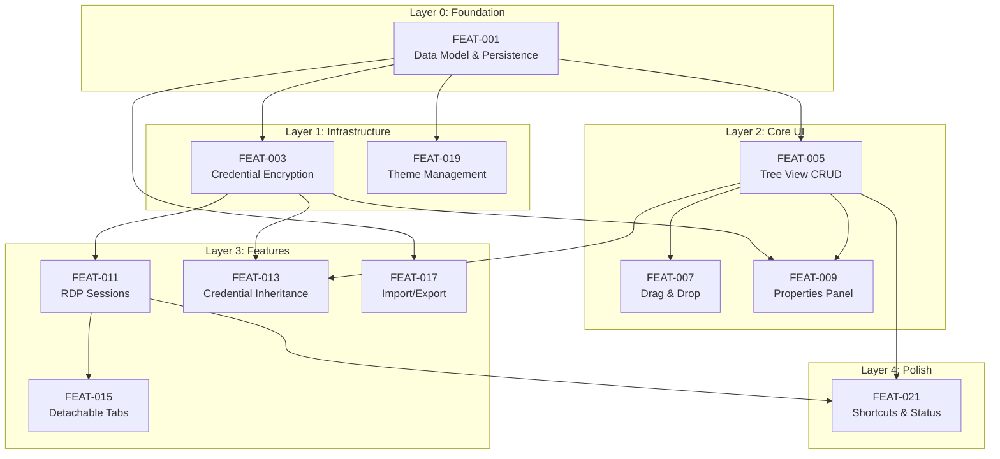

# FEAT-000: JustRDP Feature Index

## Project Metadata

| Attribute | Value |
|-----------|-------|
| **Project** | JustRDP |
| **Type** | WPF Desktop Application |
| **Tech Stack** | .NET 10, WPF, WinForms (interop), EF Core + SQLite, MaterialDesignThemes, Dragablz, CommunityToolkit.Mvvm, RoyalApps.Community.Rdp.WinForms |
| **PRD** | `docs/PRD.md` |

---

## PRD to Feature Mapping

| PRD Section | Title | Feature(s) |
|-------------|-------|------------|
| §1 | Product Overview | — (context only) |
| §2 | Technology Stack | — (context only) |
| §3 | Architecture | FEAT-001 |
| §4 | Domain Model | FEAT-001 |
| §5.1 | Tree View | FEAT-005, FEAT-007 |
| §5.2 | Properties | FEAT-009 |
| §5.3 | RDP Connections | FEAT-003, FEAT-011, FEAT-013 |
| §5.4 | Detachable Tabs | FEAT-015 |
| §5.5 | Import/Export | FEAT-017 |
| §5.6 | Theme Management | FEAT-019 |
| §5.7 | Keyboard Shortcuts | FEAT-021 |
| §5.8 | Status Bar | FEAT-021 |
| §6 | UI Layout | FEAT-005, FEAT-009, FEAT-015, FEAT-021 |
| §7 | Security | FEAT-003 |
| §8 | Data Storage | FEAT-001 |
| §9.2 | Post-MVP | FEAT-101 through FEAT-107 |
| §10 | Non-Functional Requirements | Cross-cutting |

---

## MVP Features

| ID | Title | Layer | Dependencies | Complexity | PRD Sections |
|----|-------|-------|--------------|------------|--------------|
| FEAT-001 | Data Model & Persistence | 0 | — | M | §3, §4, §8 |
| FEAT-003 | Credential Encryption (DPAPI) | 1 | FEAT-001 | S | §5.3.4, §7 |
| FEAT-005 | Tree View — CRUD & Organization | 2 | FEAT-001 | L | §5.1 |
| FEAT-007 | Tree View — Drag & Drop | 2 | FEAT-005 | M | §5.1.3 |
| FEAT-009 | Properties Panel & Dialog | 2 | FEAT-001, FEAT-003 | L | §5.2 |
| FEAT-011 | RDP Session Management | 3 | FEAT-001, FEAT-003 | L | §5.3.1–§5.3.3 |
| FEAT-013 | Credential Inheritance | 3 | FEAT-003, FEAT-005 | M | §5.3.4 |
| FEAT-015 | Detachable Tabs (Dragablz) | 3 | FEAT-011 | M | §5.4 |
| FEAT-017 | Import/Export (JSON & .rdp) | 3 | FEAT-001 | M | §5.5 |
| FEAT-019 | Theme Management (Dark/Light) | 1 | FEAT-001 | S | §5.6 |
| FEAT-021 | Keyboard Shortcuts & Status Bar | 4 | FEAT-005, FEAT-011 | S | §5.7, §5.8 |

## Post-MVP Features

| ID | Title | MVP Dependencies | PRD Sections |
|----|-------|------------------|--------------|
| FEAT-101 | RD Gateway Full Support | FEAT-011 | §9.2 |
| FEAT-103 | Connection Search & Filter | FEAT-005 | §9.2 |
| FEAT-105 | Bulk Operations (Multi-Select) | FEAT-005 | §9.2 |
| FEAT-107 | Connection History & Recents | FEAT-011 | §9.2 |

---

## Dependency Graph

---

## Implementation Tracks

### Track A: Main Application (Sequential)

| Phase | Features | Milestone |
|-------|----------|-----------|
| 1 | FEAT-001, FEAT-019 | Foundation — App opens, DB created, theme works |
| 2 | FEAT-003 | Security — Credential encryption operational |
| 3 | FEAT-005, FEAT-007 | Tree View — Full CRUD and drag-drop |
| 4 | FEAT-009 | Properties — View and edit all settings |
| 5 | FEAT-011, FEAT-013 | RDP — Working sessions with credential inheritance |
| 6 | FEAT-015 | Tabs — Chrome-style detachable tabs |
| 7 | FEAT-017 | Import/Export — JSON and .rdp portability |
| 8 | FEAT-021 | Polish — Shortcuts, status bar |

---

## Completeness Checklist

- [x] All PRD sections mapped to features
- [x] All MVP scope items have FEAT documents
- [x] All Post-MVP items have FEAT documents
- [x] No separate deployable components (single WPF app)
- [x] All data models defined (FEAT-001)
- [x] All cross-cutting concerns documented (theme, security)
- [x] No circular dependencies
- [x] Layer assignments validated
